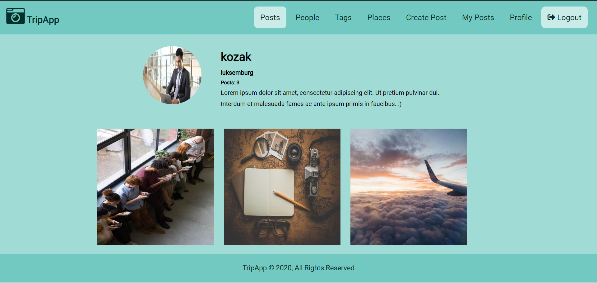

# TripApp

TripApp is a simple web application for people who want share their trips with other users.
Users can add, update and delete their posts. 
They can also like and comment other users posts.

## Technologies

Project is created with:

* asgiref==3.2.7
* Django==3.0.5
* django-taggit==1.2.0
* Pillow==7.1.1
* pytz==2019.3
* sqlparse==0.3.1


## Installation

Use the package manager pip to install TripApp
```bash
$ cd TripApp
$ python3 -m venv env
$ source env/bin/activate
$ pip install -r requirements.txt
$ python manage.py makemigrations
$ python manage.py migrate
$ python manage.py runserver
```

## Demo

<hr>

<hr>

<hr>

<hr>

<hr>

<hr>
All photos for demo I took from https://unsplash.com/.
